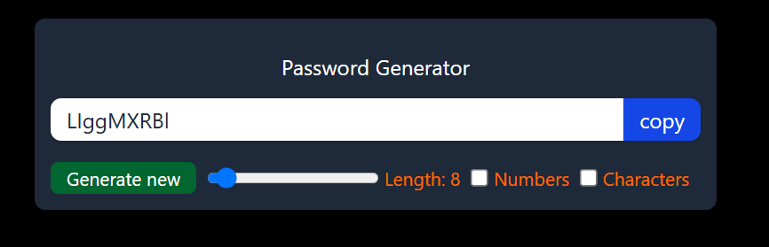
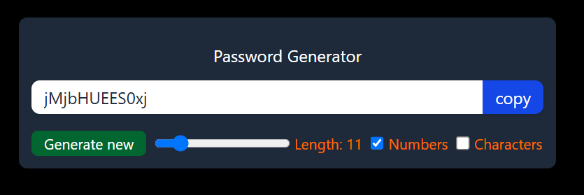
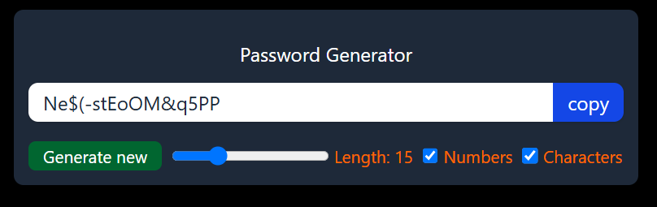

# 🔐 Password Generator (React + Tailwind CSS)

A simple password generator built using React, styled with Tailwind CSS.

## 🚀 Features

- Customizable password length
- Option to include uppercase, lowercase, numbers, and symbols
- Copy password to clipboard
- Dynamic UI updates

## 🧠 What I Learned

- React fundamentals and JSX
- Hooks: `useState`, `useCallback`, `useRef`
- Controlled components and input handling
- Tailwind CSS for styling and layout

## 📦 Tech Stack

- React
- Tailwind CSS
- JavaScript (ES6+)

## 📸 Screenshots





## 🛠️ Installation

```bash
git clone https://github.com/pulkitsujaan/PasswordGenerator.git
cd password-generator
npm install
npm start
